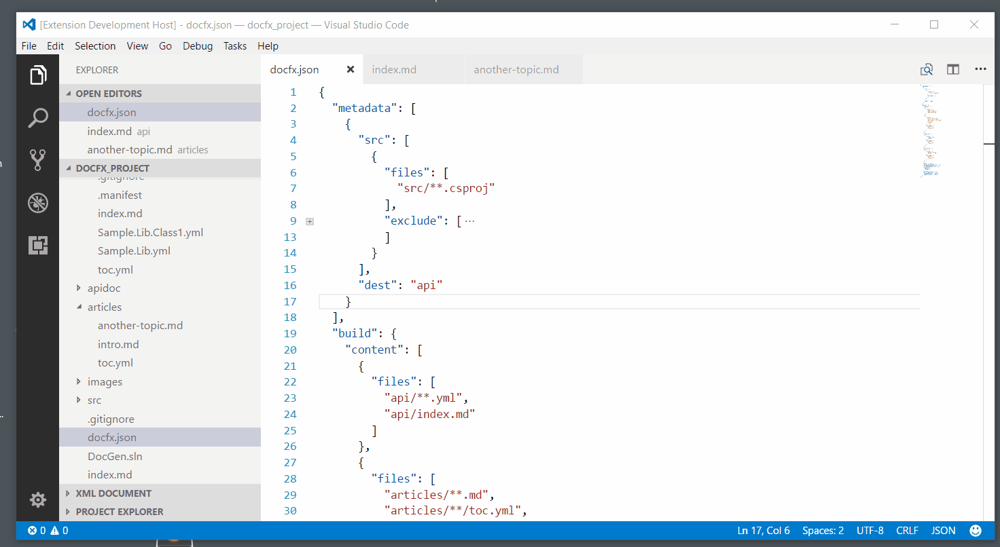

# DocFX assistant

An extension for VS Code that provides tools for authoring content using Microsoft DocFX.

I'm [planning](https://github.com/tintoy/docfx-assistant/issues/6) to eventually contribute this functionality to Microsoft's [official DocFX extension](https://marketplace.visualstudio.com/items?itemName=docfxsvc.DocFXPreview), but you're welcome to use this in the meanwhile.

## Usage

When you're editing Markdown or YAML and the workspace contains a DocFX project, type `@` or press `ctrl+space` to invoke the completion provider and bring up a pick-list of available topic UIDs.

It will also underline inline-style and (`@xxx`) and XRef-style (`<xref:xxx>`) links for UIDs into hyperlinks pointing to the documents where they are defined. If a link is not underlined, then it points to a non-existent topic.

To refresh the list of available topics, use the "DocFX: Refresh topic UIDs" command.

## Installation

You can install this extension from the [Visual Studio Marketplace](https://marketplace.visualstudio.com/items?itemName=tintoy.docfx-assistant).

## Known issues

Unless configured otherwise, the extension will automatically start scanning and updating in the background as soon as it starts (or you open a workspace with `docfx.json` in the root directory). If your `docfx.json` file is in a sub-folder, the extension will not activate until you first invoke one of its commands (at which point, it will scan all the project's content files).

There are no tests, yet.

## Questions / bug reports

If you have questions, feature requests, or would like to report a bug, please feel free to reach out by creating an issue. When reporting a bug, please try to include as much information as possible about what you were doing at the time, what you expected to happen, and what actually happened.

If you're interested in collaborating that'd be great, too :-)
