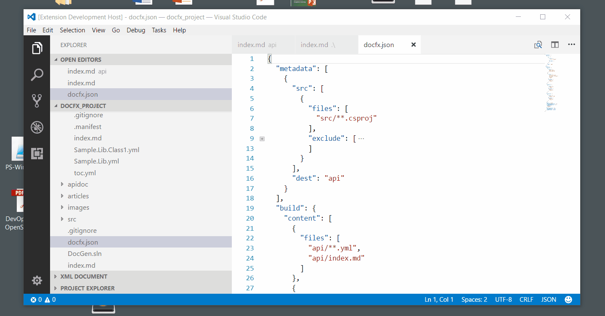

# DocFX assistant

An extension for VS Code that provides tools for authoring content using Microsoft DocFX.

## Usage

When your workspace contains a DocFX project, press `ctrl+shift+alt+u` to invoke the `DocFX: Insert any topic UID` command and bring up a pick-list of available topic UIDs.

Note - there are several variants of this command that only show topics in a specific category:

* "DocFX: Insert any topic UID" (`docfx.insertAnyTopicUID`)
* "DocFX: Insert UID for a conceptual topic" (`docfx.insertConceptualTopicUID`)
* "DocFX: Insert UID for a namespace topic" (`docfx.insertNamespaceTopicUID`)
* "DocFX: Insert UID for a type topic" (`docfx.insertTypeTopicUID`)  
  e.g. class, struct, interface
* "DocFX: Insert UID for a property topic" (`docfx.insertPropertyTopicUID`)
* "DocFX: Insert UID for a method topic" (`docfx.insertMethodTopicUID`)
* "DocFX: Insert UID for a PowerShellCmdlet topic" (`docfx.insertPowerShellCmdletTopicUID`)

To refresh the list of available topics, use the "DocFX: Refresh topic UIDs" command.

## Installation

Since this extension is not available from the VS gallery yet, simply [download](https://github.com/tintoy/docfx-assistant/releases/latest) the VSIX package for the latest release and install it by choosing "Install from VSIX" from the menu on the top right of the extensions panel.

## Known issues

Unless configured otherwise, the extension will automatically start scanning and updating in the background as soon as it starts (or you open a workspace with `docfx.json` in the root directory). If your `docfx.json` file is in a sub-folder, the extension will not activate until you first invoke one of its commands (at which point, it will scan all the project's content files).

The initial scan respects the project's content file globs (i.e. include / exclude), but the background updates do not (this will be added in a later release of the extension).

The design of this extension is a little quick-and-dirty; it works well enough, but the internals are a little-too-tightly coupled to the VSCode API for comfort. There are no tests either, yet.

## Questions / bug reports

If you have questions, feature requests, or would like to report a bug, please feel free to reach out by creating an issue. When reporting a bug, please try to include as much information as possible about what you were doing at the time, what you expected to happen, and what actually happened.

If you're interested in collaborating that'd be great, too :-)
